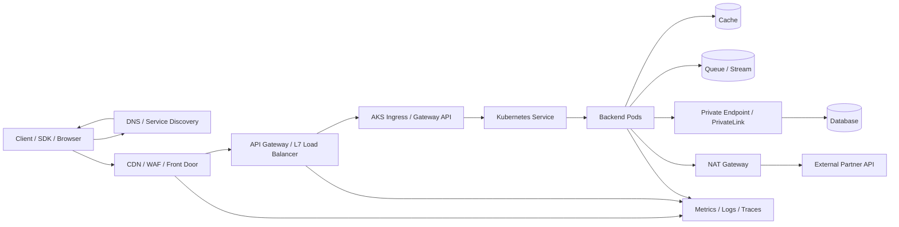
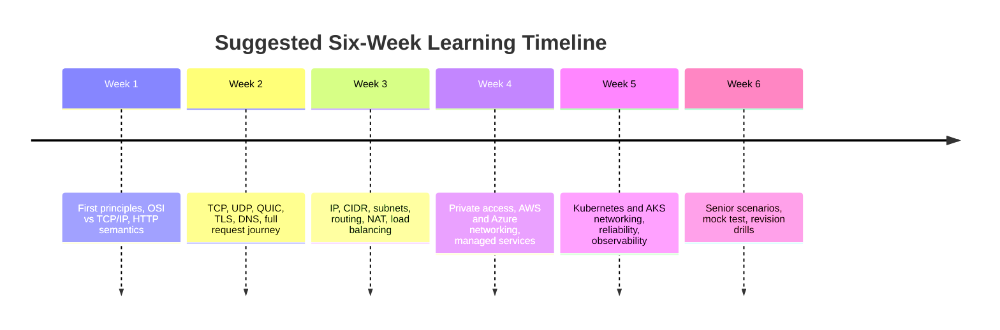
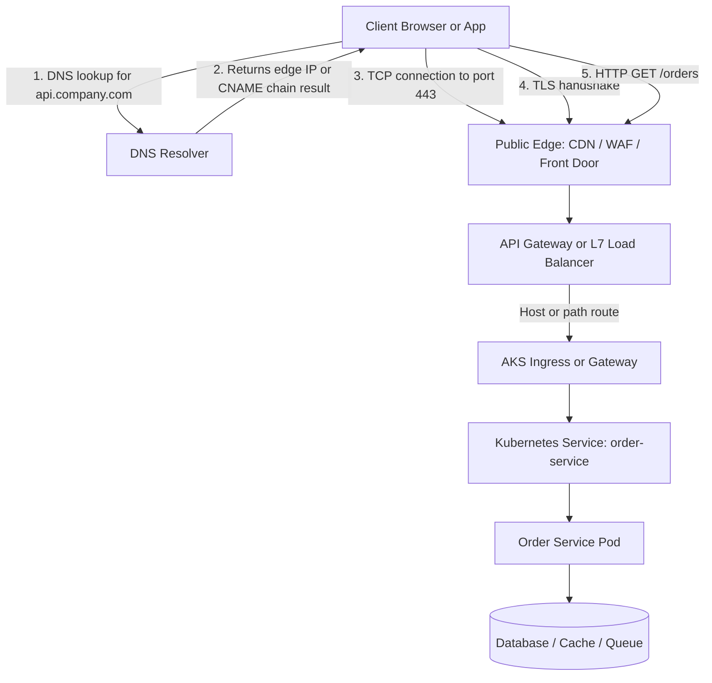
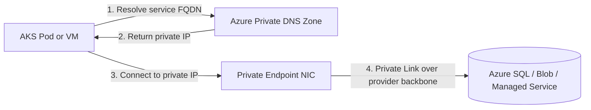
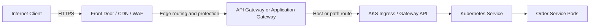
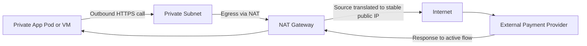
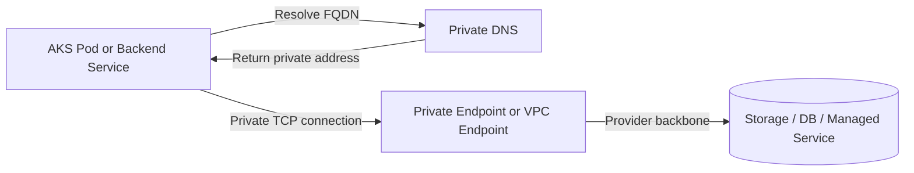
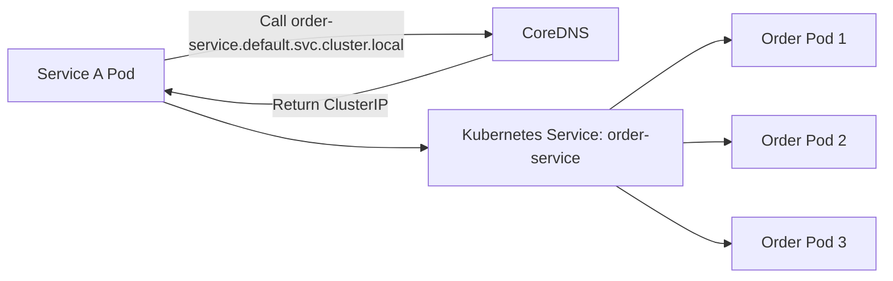
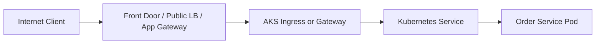
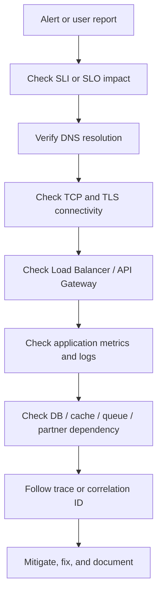

# Senior Backend Networking and Layers Master Guide

**Final quality target:** 95+ interview-ready Markdown guide.

## Executive Summary

This guide is a polished, interview-ready V2 roadmap for senior backend and cloud engineers preparing for system design and backend interviews. It treats “layers” as networking and cloud architecture layers, because that is the scope implied by the source materials. The goal is not to recite textbook definitions. The goal is to explain how a request travels, how cloud networking decisions affect systems, how Kubernetes and AKS fit into the path, and how to debug failure modes with senior-level judgement.

If you remember only one idea, remember this:

**Networking layers exist so a software process on one machine can talk to the correct software process on another machine, over a path that is routable, secure, observable, and reliable enough for the business.**

This guide is designed for repeated revision. Read it once end to end. Then revisit the Must-Mug-Up section, the Common Confusions section, the failure scenarios, and the mock test before interviews.


> Diagram note: this file contains Mermaid diagrams as real Markdown code blocks, not as text nested inside another Markdown block. In GitHub, Obsidian, many Markdown viewers, and several documentation tools, these should render as diagrams. If your viewer does not support Mermaid, the source code still shows the flow clearly.

## High-Level Senior Backend Traffic Map



This is the mental map to keep in your head during system design: public ingress comes through edge and gateways, private service-to-service traffic goes through stable service discovery, managed data services should be private where possible, and outbound partner calls should use explicit egress through NAT when allowlisting matters.

## How to Use This Guide

1. Read Sections 1 to 8 first. They build the foundation.
2. Then read Sections 9 to 15. They connect theory to cloud and Kubernetes reality.
3. Read Sections 16 to 20 as your production and senior interview layer.
4. Use Sections 21 to 24 for revision, drilling, and self-testing.
5. Keep Section 22 open during the week before interviews.

## Table of Contents

- Executive Summary
- How to Use This Guide
- Learning Objectives
- Milestones and Suggested Timeline
- Practical Projects and Exercises
- Assessment Checklist
- Recommended Core Resources
- 1. First Principles Mental Model
- 2. OSI Model vs TCP/IP Model
- 3. Application Layer
- 4. Transport Layer
- 5. Network Layer
- 6. Data Link Layer
- 7. Physical Layer
- 8. Full Request Journey
- 9. DNS Deep Dive
- 10. TLS and HTTPS
- 11. Load Balancer and API Gateway
- 12. Cloud Networking: Generic, AWS, Azure, AKS
- 13. NAT Gateway vs Load Balancer
- 14. Private Endpoint / PrivateLink / Service Endpoint
- 15. Kubernetes and AKS Networking
- 16. Reliability Add-On for Senior Networking
- 17. Observability and Incident Debugging Add-On
- 18. Senior System Design Traffic Path Example
- 19. Common Confusions and Correct Answers
- 20. Real-Life Failure Scenarios
- 21. Interview Questions and Model Answers
- 22. Must-Mug-Up Cheat Sheet
- 23. 7-Day Revision Plan
- 24. Final Mock Test
- 25. References

## Learning Objectives

By the end of this guide, you should be able to:

- Explain why networking layers exist without sounding like a textbook.
- Walk through **DNS -> TCP -> TLS -> HTTP** in the common HTTPS path.
- Distinguish **IP vs port vs HTTP path** clearly.
- Explain **TCP reliability vs business correctness**.
- Design with **public edge, private services, NAT egress, and private managed-service access**.
- Compare **AWS and Azure networking concepts** without forcing fake one-to-one mappings.
- Explain **Kubernetes Service, Ingress, Gateway API, NetworkPolicy, and AKS CNI** at a practical level.
- Debug common incidents such as 504s, broken DNS, TLS expiry, missing egress, IP exhaustion, and incorrect private DNS.
- Give a calm, interview-ready answer for traffic path and networking choices in a production system.

## Milestones and Suggested Timeline



| Milestone | Focus | Estimated duration | Output |
|---|---|---:|---|
| Foundations | Layers, OSI vs TCP/IP, HTTP methods, TCP/UDP | 5 to 7 days | You can explain the stack clearly |
| Request path mastery | DNS, TLS, HTTPS, full request journey | 4 to 6 days | You can walk a client request end to end |
| Cloud networking | VPC/VNet, subnets, CIDR, routing, NAT, private access | 6 to 8 days | You can design private and public paths |
| Kubernetes and AKS | Services, Ingress, Gateway API, NetworkPolicy, CNI | 6 to 8 days | You can explain cluster traffic paths |
| Senior production layer | Reliability, observability, failure drills | 4 to 5 days | You can debug with signal, not guesswork |
| Interview consolidation | Scenarios, Q&A, mock test, cheat-sheet | 4 to 5 days | You can answer calmly under pressure |

## Practical Projects and Exercises

| Project | Goal | What to build or write | Why it matters |
|---|---|---|---|
| Packet journey note | Make the stack intuitive | Write a page that walks `https://api.company.com/orders` from browser to pod | Forces clear layering |
| Private egress lab | Understand stable outbound IP | Design a private app subnet with NAT Gateway for a payment provider allowlist | Teaches outbound vs inbound clearly |
| Private managed-service lab | Understand private access | Sketch AKS calling storage or database through Private Endpoint or PrivateLink and private DNS | Teaches private data paths |
| Kubernetes traffic lab | Understand stable service discovery | Build a tiny cluster app where one service calls another by Service name, not Pod IP | Teaches why Service exists |
| Failure drill pack | Build debugging muscle | For 10 incident prompts, write symptom, likely cause, commands, prevention | Makes interview answers practical |
| Revision sheet | Build memorisation layer | Create your own one-page mug-up from Section 22 | Improves recall before interviews |

## Assessment Checklist

- [ ] I can explain why layers exist in plain language.
- [ ] I can explain **Application vs Transport vs Network vs Data Link vs Physical**.
- [ ] I can explain **IP tells which machine, Port tells which process, HTTP path tells which operation**.
- [ ] I can walk the common HTTPS path: **DNS -> TCP -> TLS -> HTTP**.
- [ ] I understand **safe vs idempotent** methods and why POST retries are risky.
- [ ] I can explain **TCP reliability vs business correctness**.
- [ ] I can compare **L4 vs L7 load balancing**.
- [ ] I can explain **NAT Gateway vs Load Balancer**.
- [ ] I can explain **Private Endpoint / PrivateLink / Service Endpoint** without mixing them up.
- [ ] I can explain **Kubernetes Service vs Pod IP vs Ingress vs Gateway**.
- [ ] I can explain **Azure NSG vs Kubernetes NetworkPolicy**.
- [ ] I can describe how **AKS networking models** affect pod IP planning.
- [ ] I can debug at least 10 of the failure scenarios in Section 20.

## Recommended Core Resources

| Area | Start with | Revisit for interview polish |
|---|---|---|
| HTTP, DNS, TLS, TCP | RFC 9110, RFC 1035, RFC 8446, RFC 9293 | Safe vs idempotent nuance, TCP guarantees, TLS scope |
| Kubernetes traffic | Kubernetes Service, Ingress, NetworkPolicy docs | Gateway API, service discovery, policy caveats |
| AKS and Azure networking | AKS networking concepts, Azure CNI Pod Subnet, NAT Gateway, Private Endpoint, Private DNS, NSG | Flat vs overlay, Dynamic vs Static Block Allocation, DNS nuance |
| AWS examples | VPC, subnet sizing, NAT Gateway, PrivateLink, ALB, NLB | Cross-cloud comparison answers |

## 1. First Principles Mental Model

Networking layers exist because sending data between computers is too complex to treat as one giant problem. We need a way to separate meaning, process selection, machine routing, local-hop delivery, and physical transmission. The layered model lets the application team think about requests and responses without needing to think about fibre signalling or radio modulation.

Use this courier and building analogy:

- **Application layer** = the document content and language.
- **Transport layer** = the correct desk or department inside the building.
- **Network layer** = the building address.
- **Data link layer** = the local delivery truck moving between nearby stops.
- **Physical layer** = the road, copper, fibre, or radio signal.

### Must mug up

Application layer gives meaning to the request.  
Transport layer gives process-to-process communication.  
Network layer gives machine-to-machine routing.  
Data link layer gives local-hop delivery.  
Physical layer moves bits as signals.

### Understand deeply

A request starts as meaning at the application layer. The transport layer adds process targeting and, depending on protocol, delivery guarantees. The network layer adds source and destination IP addresses so the packet can move across networks. The data link layer wraps that packet into a frame for the next local hop. The physical layer sends the bits. On the receiver side, this happens in reverse until the correct process gets the correct payload.

### Bad answer vs Good answer vs Senior answer

| Level | Answer |
|---|---|
| Bad | “The request goes through the internet and reaches the server.” |
| Good | “The request moves down the sender’s stack, across the network, and up the receiver’s stack.” |
| Senior | “The application defines semantics, the transport layer targets the correct process and may provide delivery guarantees, the network layer routes between machines, the data link layer delivers across local hops, and the physical layer carries the bits as signals.” |

## 2. OSI Model vs TCP/IP Model

The OSI model is a useful teaching and debugging model. The TCP/IP model is the practical model backend engineers use most of the time.

- **OSI** has 7 layers.
- **TCP/IP** is usually discussed as 4 or 5 practical layers.
- Backend engineers use OSI language when distinguishing things like Layer 4 vs Layer 7 load balancers.
- In real systems, they speak in practical terms like **DNS, TCP, TLS, HTTP, IP, port, NAT, route table, NSG, service discovery, Service, Ingress, Gateway, Private Endpoint**.[^rfc9110][^rfc9293][^rfc8446][^rfc1035]

| Concept | OSI layer | TCP/IP practical layer | Backend meaning |
|---|---|---|---|
| HTTP | 7 Application | Application | Request semantics, methods, paths, headers, status codes |
| HTTPS | 7 Application over 6 Presentation security | Application stack | HTTP carried over TLS |
| DNS | 7 Application | Application | Name resolution for domains |
| TLS | 6 Presentation, sometimes discussed with 5 Session | Security in the application stack | Encryption, integrity, peer identity |
| Connection pooling | 5 Session-ish in old OSI thinking | Application/runtime behaviour | Reusing expensive TCP/TLS connections |
| TCP | 4 Transport | Transport | Reliable ordered byte-stream between processes |
| UDP | 4 Transport | Transport | Datagram transport without built-in reliability |
| IP | 3 Network | Internet / Network | Host-to-host routing |
| ICMP | 3 Network | Internet / Network | Control and error signalling at network level |
| MAC | 2 Data Link | Link | Local-hop addressing |
| Ethernet | 2 Data Link | Link | Framing on wired local networks |
| Wi-Fi | 2 Data Link + 1 Physical aspects | Link / Physical | Local wireless delivery |
| Fibre / radio / copper | 1 Physical | Physical | Signal medium |

Backend engineers usually do not talk like pure OSI textbook people. They say, “DNS resolves the name, TCP connects, TLS secures, HTTP carries the request, IP routes the packet, and the load balancer decides where to send it.”

## 3. Application Layer

The application layer is where the request gains meaning. This is where HTTP, HTTPS, gRPC, WebSocket, DNS, the Redis protocol, Kafka protocol semantics, and most business-facing contracts live.[^rfc9110][^rfc1035]

At the application layer, I care about request semantics, API contract, authentication headers, idempotency, pagination, retries, and protocol choice.

Typical application-layer concerns:

- API path and meaning, such as `/orders`
- headers, for example auth, idempotency keys, trace IDs, pagination cursors
- request and response body shape
- status codes
- rate-limit headers
- caching semantics
- retries and retry safety
- protocol fit, such as HTTP, gRPC, and WebSocket

### Senior production nuance

**TCP reliability is not business correctness.**

TCP can deliver bytes reliably, but the application still needs business-safe design. A payment can be charged twice if the client retries an unsafe request without idempotency. A booking can be duplicated if the server commits work but the response is lost and the client retries blindly. HTTP semantics explicitly distinguish safe and idempotent methods, and the RFC also notes that even “safe” methods can still have side effects like logging. The point is that the client did not request a state-changing effect.[^rfc9110]

### HTTP methods, safety, idempotency, and retry behaviour

| HTTP method | Safe? | Idempotent? | Retry behaviour | Interview note |
|---|---|---|---|---|
| GET | Yes | Yes | Usually safe to retry | Read-only by contract, though servers may still log |
| HEAD | Yes | Yes | Usually safe to retry | Same safe idea as GET |
| OPTIONS | Yes | Yes | Usually safe to retry | Often used for capability discovery |
| PUT | No | Yes | Usually retryable if request body is the same | Repeating it should converge on the same resource state |
| DELETE | No | Yes | Usually retryable with care | The first call may delete, later ones may return 404, but intended effect is still idempotent |
| POST | Usually no | Usually no | Dangerous to retry blindly | Use idempotency keys for orders, payments, ledgers |

### Interview-ready line

“If the interview is about payments or orders, I do not stop at TCP reliability. I talk about idempotency keys, transactional boundaries, reconciliation, and auditability.”

## 4. Transport Layer

The transport layer is about communication between processes. IP gets you to the machine. Port gets you to the process. The application path tells you which operation the process should perform.[^rfc9293]

**IP tells which machine.**  
**Port tells which process.**  
**HTTP path tells which operation.**

### What lives here

- TCP
- UDP
- source port
- destination port
- connection setup
- retransmission
- ordering
- timeouts
- connection reuse and pooling

### Correct TCP wording

TCP gives reliable, ordered byte-stream delivery between processes, but it does not provide business-level correctness. For payments, bookings, ledgers, and order systems, we still need idempotency keys, transactions, reconciliation, audit logs, and proper state management.[^rfc9293]

### Production senior add-on

When you design or debug a real backend, transport-layer thinking often becomes:

- **Per-try timeout**: how long one attempt may run
- **Overall deadline**: total request budget
- **Retry budget**: how many retries you allow
- **Connection pooling**: avoiding repeated TCP and TLS handshakes
- **Backpressure**: refusing or slowing work when downstream is overloaded
- **Load shedding**: deliberately dropping excess requests to protect the system

### Protocol comparison

| Protocol | Guarantees | Does not guarantee | Best use | Interview caveat |
|---|---|---|---|---|
| TCP | Reliable, ordered byte-stream delivery; retransmission; flow control | Message boundaries, business correctness, exactly-once business effects | HTTP/1.1, HTTP/2, gRPC, database connections | Reliable bytes are not safe business retries |
| UDP | Datagram delivery with low overhead | Reliability, ordering, retransmission, built-in congestion semantics at app level | DNS lookups, media, gaming, QUIC substrate | The application or higher protocol must add what it needs |
| QUIC | Secure, multiplexed transport over UDP, with stream-level delivery | Universal network support in every environment, simple drop-in replacement for TCP everywhere | HTTP/3 and some modern edge traffic | Treat as optional advanced detail, not the core interview path |

### Keep QUIC and HTTP/3 simple

QUIC uses UDP as its substrate but adds a secure, multiplexed transport model. HTTP/3 uses HTTP semantics over QUIC. For most backend interviews, it is enough to say: “The common path is still DNS -> TCP -> TLS -> HTTP, but modern edge traffic may use HTTP/3 over QUIC.”[^rfc9000][^rfc9114]

## 5. Network Layer

The network layer handles machine-to-machine routing. This is where IP addresses, subnets, CIDR, route tables, NAT, VPCs, and VNets matter.[^aws-vpc][^aws-subnet]

Use this mental model:

- **VPC / VNet** = private city
- **Subnet** = neighbourhood
- **IP** = house
- **Port** = room

### Key concepts

- **Public IP**: reachable over public internet, subject to routing and firewalling
- **Private IP**: reachable inside private networks and connected paths
- **Static IP**: intentionally assigned and kept stable
- **Dynamic IP**: allocated automatically and may change
- **CIDR**: compact way of expressing address ranges
- **Subnet**: a slice of a larger network range
- **Route table**: where traffic should go next
- **NAT**: source address translation, often for outbound internet access from private resources

### CIDR refresher

A **smaller suffix means a larger range**.

- `/24` is larger than `/28`
- `/16` is much larger than `/24`
- small subnets break scaling
- large subnets reduce planning pressure but expand blast radius if used carelessly

### Clean CIDR table

| CIDR | Total IPs | Rough usable cloud IPs if used as a subnet | Typical use |
|---|---:|---:|---|
| /32 | 1 | 1 | Single host allowlist, exact endpoint |
| /31 | 2 | n/a in many common cloud subnet cases | Point-to-point style example |
| /30 | 4 | n/a in many common cloud subnet cases | Tiny lab range |
| /29 | 8 | n/a in many common cloud subnet cases | Very small appliance or lab range |
| /28 | 16 | about 11 | Small helper or endpoint subnet |
| /27 | 32 | about 27 | Small internal subnet |
| /26 | 64 | about 59 | Small service tier |
| /25 | 128 | about 123 | Small to medium app tier |
| /24 | 256 | about 251 | Common small app subnet |
| /23 | 512 | about 507 | Medium subnet |
| /22 | 1024 | about 1019 | Larger node or service subnet |
| /21 | 2048 | about 2043 | Large node pool or platform subnet |
| /20 | 4096 | about 4091 | Larger AKS or platform subnet |
| /19 | 8192 | about 8187 | Very large subnet |
| /18 | 16384 | about 16379 | Large network slice |
| /17 | 32768 | about 32763 | Very large network slice |
| /16 | 65536 | about 65531 | Common VPC or VNet range |
| /12 | 1048576 | about 1048571 | Large organisational private range |
| /8 | 16777216 | about 16777211 | Very large private range |

> Practical note: AWS and Azure both reserve five IPs in a subnet, though the valid subnet-size rules differ by service and scenario.[^aws-subnet][^azure-private-ip]

### Why CIDR matters in interviews

CIDR matters because scaling consumes addresses. In Kubernetes and AKS, **nodes, pods, services, internal load balancers, and private endpoints** can all consume address space depending on the networking model. If you under-size the range, scaling fails in ugly ways.

### Interview-ready line

“I always sanity-check IP planning early, because IP exhaustion is a boring problem right up until it stops cluster growth.”

## 6. Data Link Layer

The data link layer handles local-hop delivery. It uses frames and local hardware addressing such as MAC addresses.

Important ideas:

- hosts and routers use **ARP** to map an IPv4 address to a MAC address on the local network
- switches forward frames based on **MAC address tables**
- this is about **local-hop delivery**, not end-to-end semantics
- **data link is not the same as physical**

### Correct mental model

- **MAC changes at every hop**
- **IP usually stays the same across hops, except NAT**
- **Port usually stays the same**
- **HTTP request stays logically the same**

### What changes at each hop

```text
Client laptop
  IP packet: 203.0.113.10 -> 20.52.10.8
  TCP ports: 51514 -> 443
  HTTP: GET /orders
  Frame on local LAN: LaptopMAC -> HomeRouterMAC

ISP hop
  IP packet: 203.0.113.10 -> 20.52.10.8
  TCP ports: 51514 -> 443
  HTTP: same logical request
  Frame on this hop: ISPRouterMAC -> NextHopMAC

Cloud edge hop
  IP packet: 203.0.113.10 -> 20.52.10.8
  TCP ports: 51514 -> 443
  HTTP: same logical request
  Frame on this hop: CloudEdgeMAC -> LoadBalancerMAC
```

### Senior nuance

If the interviewer asks about ARP, answer simply:

“On IPv4 networks, ARP is how a host or router resolves a local next-hop IP to a MAC address. Switches then forward frames using their MAC tables. That is local-hop behaviour, not end-to-end routing.”

## 7. Physical Layer

The physical layer moves raw bits as signals.

Examples:

- electrical signal over copper
- light over fibre
- radio over Wi-Fi or cellular

Backend engineers rarely go deep here because cloud platforms abstract almost all physical details. Still, it matters conceptually because every higher layer eventually becomes bits on some medium.

## 8. Full Request Journey

Let’s walk the common request:

`https://api.company.com/orders`

### Correct common HTTPS sequence

**DNS -> TCP -> TLS -> HTTP**

HTTPS is HTTP over TLS over TCP.

### Full flow



### Layer wrapping diagram

```text
Application
+----------------------------------------------+
| HTTP request: GET /orders                    |
+----------------------------------------------+

TLS
+----------------------------------------------+
| Encrypted application payload                |
+----------------------------------------------+

Transport
+----------------------------------------------+
| TCP segment: source port -> destination 443  |
+----------------------------------------------+

Network
+----------------------------------------------+
| IP packet: source IP -> destination IP       |
+----------------------------------------------+

Data Link
+----------------------------------------------+
| Frame: source MAC -> next-hop MAC            |
+----------------------------------------------+

Physical
+----------------------------------------------+
| Bits over wire / fibre / radio               |
+----------------------------------------------+
```

### Important nuance

In the common HTTPS-over-TCP path, the sequence is **DNS -> TCP -> TLS -> HTTP**. DNS may already be cached. TLS may be resumed. If HTTP/3 is in play, the transport changes from TCP to QUIC over UDP, but the big mental model remains the same: resolve, connect securely, then speak HTTP.[^rfc8446][^rfc9114]

## 9. DNS Deep Dive

DNS is application layer, but it returns network-layer addresses.[^rfc1034][^rfc1035]

### Core DNS records to know

- **A record**: name to IPv4 address
- **CNAME**: alias to canonical name
- **TTL**: how long a record may be cached
- **Public DNS**: internet-visible resolution
- **Private DNS**: internal resolution inside a private environment
- **Split-horizon DNS**: same hostname resolves differently inside and outside

### Why backend engineers care

DNS problems often look like “the app is down” when the app is fine.

- wrong A record can point users to the wrong load balancer
- high TTL can slow failover
- private endpoints often require private DNS so the normal hostname resolves to the private IP
- Kubernetes uses DNS for internal service discovery

### Private DNS plus Private Endpoint resolution



### Practical notes

- TTL affects cache lifetime, which affects failover speed.
- A `CNAME` is an alias, not an IP address.
- In Kubernetes, CoreDNS resolves Service names like `order-service.default.svc.cluster.local`.
- In Azure private-access setups, getting the private endpoint DNS wrong is one of the most common causes of mysterious failure.[^rfc1035][^azure-private-endpoint][^azure-private-dns][^aks-networking]

## 10. TLS and HTTPS

TLS secures application traffic carried over a transport connection. In the common path, that means **HTTP over TLS over TCP over IP**.[^rfc8446]

### Stack to remember

```text
HTTP
TLS
TCP
IP
```

### High-level TLS handshake idea

At a high level:

1. client and server agree on supported cryptographic parameters
2. server proves identity with a certificate chain
3. both sides derive keys for secure communication
4. application data then flows over the secure channel

### Important concepts

- **HTTP vs HTTPS**: HTTPS is HTTP carried inside TLS
- **Certificate authority**: trusted issuer chain for server identity
- **TLS termination**: often at a load balancer, ingress, edge proxy, or API gateway
- **End-to-end TLS**: keep TLS all the way to the service if required
- **mTLS**: both sides authenticate with certificates
- **Certificate rotation**: operational necessity, not optional hygiene

### Senior nuance

- mTLS proves identity, not authorisation.
- Terminating TLS at the edge can simplify certificate management and enable L7 routing.
- End-to-end TLS may still be required for internal zero-trust or compliance-heavy environments.
- Certificate expiry is a classic production incident because everything can look “network-related” when the real problem is expired identity material.

## 11. Load Balancer and API Gateway

Load balancing is about distributing traffic across backends. API gateways add policy and application-level behaviour on top of routing.

### Must remember

- **L4 = IP + port + TCP/UDP**
- **L7 = HTTP, gRPC, or other application-aware routing**

### Inbound flow example



### What each layer usually does

| Component | Typical level | What it usually understands | Typical examples |
|---|---|---|---|
| L4 Load Balancer | Transport | IP, port, TCP/UDP | AWS NLB, Azure Load Balancer |
| L7 Load Balancer | Application | HTTP host, path, headers, TLS termination | AWS ALB, Azure Application Gateway |
| Global edge service | Edge + L7 | Global routing, edge security, acceleration | Azure Front Door |
| API Gateway | L7 + policy | Auth, quotas, rate limits, request validation, routing | Managed API gateways, gateway products |
| Kubernetes Ingress | L7 entry into cluster | HTTP/HTTPS routes into Services | NGINX Ingress, cloud ingress controllers |
| Gateway API | Kubernetes gateway model | Gateway, listeners, routes, attachment rules | Kubernetes Gateway implementations |

### Senior nuance

- An Ingress is not a Service type.
- Ingress handles HTTP and HTTPS, not arbitrary protocols.
- Gateway API gives a richer model with Gateways, listeners, route types, and attachment rules.
- Health checks should be lightweight. A readiness endpoint that depends on every downstream can create false negatives and cause healthy app instances to be ejected.[^k8s-service][^k8s-ingress][^gateway-api][^azure-appgw][^azure-frontdoor][^aws-alb][^aws-nlb]

### Interview-ready line

“I separate responsibilities clearly. Edge and gateway deal with ingress policy and routing, Services solve stable internal discovery, and pods stay replaceable.”

## 12. Cloud Networking: Generic, AWS, Azure, AKS

This section matters because interviewers often want to know whether you can speak generically before dropping into provider specifics.

| Concept | Generic meaning | AWS reference | Azure reference | AKS/Kubernetes angle | Important caveat |
|---|---|---|---|---|---|
| Private cloud network | Your isolated virtual L3 boundary | VPC | VNet | AKS clusters live inside Azure networking boundaries | Kubernetes does not replace VPC or VNet |
| Subnet | Slice of address space inside the private network | Subnet | Subnet | Nodes, LBs, and sometimes pods consume subnet IPs | Non-overlapping CIDRs matter |
| Public subnet | Can host resources with a public ingress path | Subnet routed to IGW with public exposure | Public IP-exposed subnet patterns | Usually edge resources, not worker nodes | “Public subnet” is a design pattern, not a magic security boundary |
| Private subnet | No direct public ingress to workloads | Private subnet | Subnet without public exposure | Preferred for app tiers and nodes | Still needs egress design |
| Route table | Decides next hop | Route table | Route table / UDR | Important for egress, appliances, and some endpoint patterns | Routing is not filtering |
| Internet access | Public reachability pattern | IGW, EIP, NAT | Public IP, Front Door, App Gateway, NAT | Ingress and egress are separate concerns | Do not mix inbound exposure with outbound access |
| NAT Gateway | Stable outbound internet path | NAT Gateway | Azure NAT Gateway | Useful for cluster egress to external APIs | Not for inbound traffic |
| Stable outbound IP | Fixed egress identity | Elastic IP on NAT | Public IP on NAT Gateway | Partner allowlists depend on this | Not the same as a service address |
| Firewall rules | Allow or deny traffic | Security Groups / NACL | NSG / Azure Firewall | K8s NetworkPolicy works at pod level if supported | Scope and layer differ |
| Managed Kubernetes | Managed control plane plus cloud integration | EKS | AKS | Services, ingress, and CNI sit on top of cloud networking | Managed does not mean simple |
| Pod-level policy | Segment pod traffic | NetworkPolicy with supported CNI | NetworkPolicy with supported CNI | Label-based allow rules | No effect without supporting plugin |
| Private managed-service access | Private path to managed services | PrivateLink / VPC endpoints | Private Endpoint / Private Link | Common for DB, storage, secret stores | Not all services map one-to-one across clouds |
| Private DNS | Internal name resolution | Route 53 private hosted zones | Azure Private DNS | Needed for private endpoints and internal names | DNS mistakes can break correct networking |
| Object storage | Managed blob or object service | S3 | Blob Storage | Reach via SDK, identity, and maybe private endpoint | Networking is not authorisation |
| Identity | Who may call what | IAM roles and policies | Managed Identity / Entra / Workload Identity | AKS Workload Identity is common | Identity complements networking |
| App subnet vs DB subnet | Tier separation | Separate private app and DB ranges | Separate app and DB subnets | Better blast-radius control | Small systems can start simpler |
| Private endpoint subnet | Address budget for private endpoint NICs | Endpoint ENIs in subnets | Private endpoint NIC in subnet | Plan room for private endpoints | DNS must resolve to the endpoint |

### Cloud-specific nuance that interviewers like

- AWS VPC is the virtual network boundary.
- Azure VNet is the virtual network boundary.
- AKS uses Azure networking underneath, but pod addressing can be overlay-style or flat depending on the chosen model.
- With Azure Service Endpoints, DNS often still resolves to public service names and the service keeps its public endpoint behaviour model. With Private Endpoint, you are using private IP-based access instead.[^aws-vpc][^aws-subnet][^aws-nat][^aws-privatelink][^aws-vpc-endpoints][^azure-service-endpoints][^azure-private-endpoint][^azure-private-dns][^aks-networking][^aks-cni-overview]

## 13. NAT Gateway vs Load Balancer

This is one of the most common interview confusions.

### Core truth

- **NAT Gateway is mainly for outbound internet access from private resources.**
- **Load Balancer is often for inbound traffic distribution.**
- **NAT Gateway gives stable egress IP.**
- **Public Load Balancer gives stable ingress path.**
- **A private service should not need a public IP just to call out.**
- **Payment provider allowlisting usually wants your outbound egress IP.**
- **A NAT Gateway does not expose the service for public inbound traffic.**

### Outbound NAT flow



### Comparison table

| Component | Main direction | Gives stable IP for | Example use |
|---|---|---|---|
| Load Balancer | Inbound | Clients calling you | Public API traffic |
| NAT Gateway | Outbound | You calling external services | Payment provider allowlisting |

### Interview line

“I would keep the service in a private subnet and route outbound internet traffic through a NAT Gateway. The NAT Gateway has a stable public egress IP that the payment provider can allowlist, while the service itself remains non-public.”[^azure-nat][^aws-nat]

### Senior nuance

On Azure, attaching NAT Gateway to the subnet gives outbound connectivity without extra route-table work for the normal internet path. On AWS, the common design is to route `0.0.0.0/0` from a private subnet to a NAT Gateway in a public subnet. Same concept, different mechanics.[^azure-nat][^aws-nat]

## 14. Private Endpoint / PrivateLink / Service Endpoint

This area is worth learning properly because many candidates mix all three concepts.

### What “private endpoint” means

A private endpoint gives **private IP-based access** from your private network to a managed service. On Azure, it is literally a NIC in your VNet with a private IP. On AWS, interface or resource-style VPC endpoints and PrivateLink provide the private connection model.[^azure-private-endpoint][^aws-privatelink][^aws-vpc-endpoints]

### Important nuance

Do **not** say, “Without Private Endpoint all traffic always goes over the public internet via NAT.”

A better statement is:

“Without private connectivity, traffic may use public service endpoints or public IP paths depending on cloud and service setup. Private Endpoint or PrivateLink gives private IP-based access and often lets you disable public access.”

### Compare the common patterns

| Pattern | What it does | DNS story | Caveat |
|---|---|---|---|
| Azure Private Endpoint | Private IP in your VNet for a managed service | Usually needs Private DNS | Best when you want private IP access and often to disable public access |
| AWS PrivateLink / Interface endpoint | Private connectivity from your VPC to a service | Usually uses DNS integration or private hosted zones | Great for private service consumption |
| Azure Service Endpoint | Extends VNet identity to supported Azure services over Azure backbone | DNS often still resolves to public service names | Not the same as Private Endpoint |
| AWS Gateway Endpoint | Private route to S3 or DynamoDB | Route-table based, not PrivateLink | Specific to certain AWS services |

### Private Endpoint flow



### Interview line

“For sensitive managed services like storage or database, I would prefer Private Endpoint or PrivateLink so traffic can stay private and public access can be disabled.”[^azure-private-endpoint][^aws-privatelink][^azure-service-endpoints]

## 15. Kubernetes and AKS Networking

Kubernetes networking solves one central problem: pods are replaceable, but communication still needs stable names and paths.

### Core ideas

- **Pod**: basic deployable unit, each pod gets an IP
- **Node**: VM or machine running pods
- **Pod IP**: not stable enough to be a service contract
- **ClusterIP Service**: stable internal service abstraction
- **Ingress**: HTTP/HTTPS entry into the cluster
- **LoadBalancer Service**: cloud load balancer exposure
- **NetworkPolicy**: pod-level traffic filtering, if the networking plugin supports it
- **CNI**: plugin family that manages pod networking

### Stable internal service-to-service traffic

**Inside cluster = Kubernetes Service / ClusterIP**



### External ingress into AKS

**Outside cluster = Ingress or LoadBalancer**



### AKS-specific examples

- AKS nodes always live inside Azure networking boundaries.
- Pods may use an **overlay pod CIDR** or a **flat VNet address model**, depending on the chosen AKS networking model.
- AKS Services exposed as `LoadBalancer` typically create corresponding Azure load balancer resources.
- Ingress can be implemented with NGINX, cloud-specific controllers, or Gateway API implementations.
- AKS can use NAT Gateway for stable outbound access.
- AKS can reach Azure Storage or Azure SQL privately through Private Endpoint plus Private DNS.
- AKS commonly uses Managed Identity or Workload Identity for cloud authorisation.

### Correct Azure CNI wording

Do not say, “Azure CNI dynamic IP allocation equals prefix delegation.”

Say this instead:

“Azure CNI Pod Subnet with Dynamic IP Allocation uses a separate pod subnet and allocates pod IPs to nodes in batches. Azure also has Static Block Allocation, where blocks are assigned to nodes. The big design point is to plan pod IP ranges separately so cluster growth does not exhaust the node subnet.”[^aks-networking][^aks-cni-overview][^aks-cni-pod-subnet]

### Important reminders

- Pods are ephemeral, so use a Service name for stable internal access.
- Ingress is not enough by itself, it needs a controller.
- NetworkPolicy works only if the networking solution supports it.
- NetworkPolicy is primarily L4, not full application-layer policy.
- For AKS, NSG is usually the node or subnet-level filter, while NetworkPolicy is the pod-level filter.[^k8s-service][^k8s-ingress][^k8s-networkpolicy][^aks-networking]

## 16. Reliability Add-On for Senior Networking

Networking fails. Senior engineers assume it will fail and design for controlled failure.

### What to do in production

- set explicit deadlines
- use per-try timeouts
- keep retries bounded
- use retry budgets
- require idempotency keys for unsafe operations
- add circuit breakers
- rate-limit where needed
- use bounded queues
- apply backpressure
- use shallow health checks

### Why it matters

- retrying unsafe operations can duplicate orders or payments
- unbounded retries create retry storms
- circuit breakers stop one broken dependency from dragging the whole system down
- rate limits protect the system
- shallow health checks avoid false negatives created by downstream slowness

### Practical table

| Concept | What it prevents | Example |
|---|---|---|
| Deadline | End-to-end requests hanging too long | Overall request must finish within 2.5 s |
| Per-try timeout | One attempt waiting forever | DB try times out after 300 ms |
| Retry budget | Retry storms | At most 2 retries within caller budget |
| Idempotency key | Duplicate business actions | POST /payments with a client-generated key |
| Circuit breaker | Cascading failures | Payment dependency fails fast while unhealthy |
| Rate limiting | Overload from abusive or bursty traffic | 100 requests per second per tenant |
| Bounded queue | Infinite work backlog | Queue capped at safe memory limit |
| Backpressure | Silent overload growth | Return 429 or 503 instead of unlimited buffering |
| Load shedding | Full-system brownout | Drop low-priority work under heavy load |
| Shallow health check | Wrongly ejecting healthy app instances | Readiness checks local app state, not every downstream |

### Senior interview line

“I would use explicit deadlines, bounded retries, idempotency keys for unsafe operations, and circuit breakers so one slow dependency does not cause retry amplification and overload the system.”

## 17. Observability and Incident Debugging Add-On

Observability is how you stop guessing.

### Four things to remember

- **Metrics** tell you something is wrong.
- **Logs** tell you local details.
- **Traces** tell you where the time was spent across hops.
- **SLOs** tell you whether users are actually being harmed.

### Golden signals

- **Latency**
- **Traffic**
- **Errors**
- **Saturation**

### Incident-debugging flow



### Practical observability habits

- put a correlation ID or trace ID on every request
- propagate the same context into async work
- measure latency by stage, not just end to end
- separate user-visible failures from noisy-but-non-impacting internal warnings
- alert on symptoms that matter to users, not only host-level resource alarms

## 18. Senior System Design Traffic Path Example

**Prompt:** Design an order service where clients call `api.company.com/orders`.

### Polished senior-level answer

“The client first resolves `api.company.com` through DNS. For an internet-facing system I would usually place a public edge in front, such as a CDN and WAF layer or a global edge service, so that basic protection, caching opportunities, and edge routing happen before traffic reaches the application tier.

For the common HTTPS path, the client establishes a TCP connection to port 443, performs the TLS handshake, and then sends the HTTP request. At the regional entry point I would use either an API Gateway or an L7 load balancer. That layer can terminate TLS if appropriate, enforce auth and quotas, and route `/orders` traffic to the right backend.

Inside the AKS cluster, traffic enters through Ingress or Gateway API and then reaches a Kubernetes Service, which provides stable internal discovery and load balancing across ephemeral order-service pods. I would not send traffic directly to pod IPs because pods are replaceable.

The order-service itself should be private. Its database should live on a private path, ideally reached through Private Endpoint plus private DNS so the normal hostname resolves to a private IP and public access can be disabled. If the service must call an external payment provider that requires allowlisting, I would route outbound traffic through a NAT Gateway so the service stays private but has a stable egress IP.

For safety, I would use idempotency keys for payment-like POSTs, strict deadlines, bounded retries, and a circuit breaker around slow downstreams. For operations, I would instrument the full path with metrics, logs, and distributed tracing so I can tell whether the issue is DNS, TLS, gateway routing, backend latency, or a downstream dependency. If I saw a 504, I would not assume only backend slowness. I would check gateway timeout settings, backend latency, dependency latency, network rules, and health-check behaviour.”

## 19. Common Confusions and Correct Answers

| Misconception | Correct answer |
|---|---|
| HTTP is transport layer | HTTP is application layer. TCP and UDP are transport. |
| DNS is network layer | DNS is application layer, even though it returns network-layer addresses. |
| IP is TCP | IP routes between machines. TCP provides transport semantics between processes. |
| Port is part of IP | Port is not part of IP, but `IP:port` is used together to identify a socket endpoint. |
| TLS is HTTP | TLS is not HTTP. HTTPS is HTTP carried inside TLS. |
| VPC or VNet is application layer | VPC and VNet are cloud network constructs, not application-layer constructs. |
| Load balancer means L7 | Load balancers can be L4 or L7. |
| Kubernetes Service is always a LoadBalancer | The default Service type is ClusterIP. |
| Data link is physical layer | Data link uses frames and local-hop addressing. Physical moves bits as signals. |
| MAC stays the same end to end | MAC changes at each local hop. |
| IP changes at every hop | IP usually stays the same end to end, except NAT or proxy termination cases. |
| NAT Gateway is inbound | NAT Gateway is primarily outbound. |
| Load Balancer is outbound | Load balancers are commonly used for inbound traffic distribution. |
| Private Endpoint is NAT Gateway | Private Endpoint is private service access, not public egress translation. |
| NSG is route table | NSG filters traffic. Route table chooses next hop. |
| Kubernetes NetworkPolicy is Azure NSG | NetworkPolicy is pod-level policy; NSG is subnet or NIC-level filtering. |
| TCP reliability is business correctness | Reliable bytes do not guarantee safe business outcomes. |
| Retry is always safe | Unsafe operations, especially POST, need idempotency design. |
| DNS caching always helps | DNS caching can delay failover. |
| mTLS replaces authorisation | mTLS proves identity, but you still need authorisation rules. |
| 504 always means backend slowness | 504 means an upstream response was not received in time; several layers can cause that. |
| Private Endpoint works automatically once created | DNS must resolve the service hostname to the private address for the path to work. |

## 20. Real-Life Failure Scenarios

| Scenario | Symptom | Likely cause | Layer involved | Debugging approach | Prevention | Interview answer |
|---|---|---|---|---|---|---|
| 1. DNS record points to wrong load balancer | Users hit wrong environment or get odd 404s | Wrong A or CNAME record | DNS / Application | Check authoritative DNS answer, CNAME chain, intended target | IaC for DNS, peer review, TTL control | “I would verify the authoritative DNS target before changing the app.” |
| 2. DNS TTL delays failover | Region failover appears slow | Clients still cache old answer | DNS | Compare current authoritative answer vs client cache age | Lower TTL on critical failover records | “Failover speed is partially bounded by cache expiry.” |
| 3. TLS certificate expired | Browser warnings or TLS handshake failures | Rotation missed | TLS | Inspect certificate validity and chain | Automated renewal and alerting | “This is an identity problem at the secure transport layer, not basic routing.” |
| 4. Client resolves DNS but cannot connect to 443 | Request hangs before app logic | Firewall, NSG, missing listener, blocked port | Transport / Network | Test TCP connectivity, verify listener and rules | Explicit policy tests and synthetic checks | “I would separate name resolution from transport reachability.” |
| 5. NSG blocks app-to-DB traffic | App times out on DB calls | Missing allow rule between tiers | Network | Check NSG rules and effective path | Security baselines and tier-specific testing | “The route may be correct but filtering can still block the flow.” |
| 6. DB public access accidentally enabled | Data tier exposed publicly | Public endpoint or broad allow rule left on | Network / Security | Audit DB exposure and firewall rules | Policy guardrails, private-by-default templates | “I would move to private access and disable public exposure.” |
| 7. NAT Gateway missing | Private service cannot call external API | No explicit outbound path | Network | Check subnet egress design and outbound resource | Standardise subnet egress patterns | “Private workloads still need planned egress.” |
| 8. Payment provider sees changing IPs | Partner blocks requests | Egress comes from changing node or instance IPs | Network | Check actual source IP leaving the environment | Use NAT Gateway for stable egress | “Stable outbound IP is a NAT design problem.” |
| 9. Pod restarted and IP changed | Direct pod calls start failing | Caller hardcoded Pod IP | Application / K8s | Inspect caller destination and service discovery usage | Use Service DNS names | “Pods are replaceable, Services are the stable contract.” |
| 10. Service calls Pod IP directly | Works until rollout or reschedule | Bypassed Service abstraction | Application / K8s | Compare direct pod address use vs Service | Coding standards and internal service discovery patterns | “Direct Pod IP coupling is fragile by design.” |
| 11. Load balancer health checks fail | Healthy pods removed from rotation | Health check too deep or blocked | L7 / App / Network | Verify health endpoint, status codes, and allowed probe path | Shallow health checks | “A health check should answer ‘can I serve?’, not ‘is every dependency perfect?’” |
| 12. API Gateway returns 504 | Clients see timeout from gateway | Upstream latency, wrong timeout, blocked path, unhealthy dependency | L7 / App / Network | Compare gateway timeout to backend and dependency latency | Budget timeouts by layer | “A 504 is an upstream response timing issue, not a single-cause error.” |
| 13. Private Endpoint exists but DNS resolves public IP | Traffic still uses public path | Private DNS not linked or incorrect override | DNS / Private access | Resolve FQDN from inside workload and verify returned IP | Standardise private DNS setup | “Private access is both networking and naming.” |
| 14. IP exhaustion in AKS or Kubernetes subnet | Pods remain Pending or scale-outs fail | Range too small for chosen model | Network / Capacity | Check available IPs, node count, pod model | Plan node and pod CIDRs early | “Address planning is a scaling dependency.” |
| 15. L7 path routing misconfigured | `/users` lands on orders backend or 404s | Bad path rule or precedence | Application / Gateway | Inspect route rules, priority, and match type | Route reviews and tests | “I would verify host and path matching before blaming services.” |
| 16. Retry storm overloads backend | Traffic multiplies during outage | No retry budget or backoff | Application / Reliability | Inspect caller behaviour and retry loops | Retry budgets, backoff, circuit breakers | “Retries can amplify failure if not bounded.” |
| 17. POST retried and duplicate order created | Customer sees duplicate order or charge | Unsafe retry without idempotency key | Application | Trace request IDs and dedupe logic | Require idempotency on unsafe operations | “Reliable transport is not duplicate-safe business logic.” |
| 18. Circuit breaker opens | Calls fail fast immediately | Dependency unhealthy, breaker protecting system | Reliability | Inspect breaker metrics and dependency state | Tune thresholds and follow-up playbooks | “Fast failure can be healthy protective behaviour.” |
| 19. Existing connections still work after firewall or NSG change but new ones fail | Mixed behaviour during rule change | Stateful filtering and existing flows | Network / Transport | Compare old vs new connections | Change windows and connection-aware testing | “New connections are blocked, but established ones may continue.” |
| 20. Trace ID missing across async queue boundary | End-to-end request becomes untraceable | Context not propagated into message headers | Observability / Application | Check producer and consumer metadata propagation | Standard tracing middleware and queue header propagation | “Async boundaries need explicit trace-context propagation.” |

## 21. Interview Questions and Model Answers

### MCQs

| # | Question | Options | Answer | One-line explanation and Senior expectation |
|---|---|---|---|---|
| 1 | Which layer gives process-to-process communication? | a) Network<br>b) Transport<br>c) Data Link<br>d) Physical | b | Transport uses ports to reach the correct process. Senior expectation: separate host routing from process demultiplexing. |
| 2 | DNS is best described as which layer? | a) Data Link<br>b) Network<br>c) Application<br>d) Physical | c | DNS is an application protocol, even though it returns IP addresses. Senior expectation: avoid mixing data returned with layer of protocol. |
| 3 | What usually changes at every hop? | a) Destination port<br>b) HTTP path<br>c) MAC address<br>d) Business semantics | c | Frames are per local hop. Senior expectation: understand local-hop vs end-to-end state. |
| 4 | Roughly how many usable addresses remain in a `/24` cloud subnet after common reservations? | a) 11<br>b) 27<br>c) 251<br>d) 4091 | c | 256 total, about 251 usable in common AWS and Azure cases. Senior expectation: do quick CIDR sanity checks. |
| 5 | What is the common HTTPS sequence? | a) TCP -> DNS -> TLS -> HTTP<br>b) DNS -> TCP -> TLS -> HTTP<br>c) DNS -> HTTP -> TLS -> TCP<br>d) TLS -> HTTP -> TCP -> DNS | b | Resolve first, connect second, secure third, then speak HTTP. Senior expectation: walk it cleanly. |
| 6 | Which protocol gives reliable, ordered byte-stream delivery? | a) UDP<br>b) ICMP<br>c) TCP<br>d) ARP | c | That is the core TCP contract. Senior expectation: know what TCP guarantees and what it does not. |
| 7 | Which method is usually not idempotent unless designed carefully? | a) GET<br>b) PUT<br>c) DELETE<br>d) POST | d | POST often needs idempotency keys for safe retries. Senior expectation: tie protocol semantics to business safety. |
| 8 | Which device or service normally understands HTTP path routing? | a) L4 load balancer<br>b) L7 load balancer or API gateway<br>c) NAT Gateway<br>d) Switch | b | Path and host routing are L7 concerns. Senior expectation: distinguish transport-aware from application-aware routing. |
| 9 | What is a NAT Gateway mainly for? | a) Inbound distribution<br>b) Outbound internet access<br>c) Private DNS<br>d) Pod scheduling | b | NAT Gateway primarily solves outbound egress identity and reachability. Senior expectation: inbound vs outbound clarity. |
| 10 | What does a Private Endpoint mainly provide? | a) Packet retransmission<br>b) Public service exposure<br>c) Private IP-based access to a service<br>d) Pod autoscaling | c | It brings private service access into your private network. Senior expectation: include DNS nuance too. |
| 11 | Why does Kubernetes Service exist? | a) To replace DNS<br>b) To give stable access to ephemeral pods<br>c) To replace load balancers everywhere<br>d) To assign MAC addresses | b | Services decouple clients from pod churn. Senior expectation: say “stable contract over replaceable pods.” |
| 12 | What does an Ingress mainly expose? | a) Arbitrary TCP and UDP ports<br>b) HTTP and HTTPS routes to Services<br>c) Raw Ethernet frames<br>d) Database sockets directly | b | Ingress is for HTTP and HTTPS entry into Services. Senior expectation: mention controller requirement. |
| 13 | Why might a NetworkPolicy have no effect? | a) TCP is disabled<br>b) DNS is cached<br>c) The network plugin does not implement it<br>d) The cluster has too many nodes | c | NetworkPolicy enforcement depends on the plugin. Senior expectation: know it is not self-enforcing YAML. |
| 14 | Which statement is correct? | a) NSG and route table are the same thing<br>b) NSG filters traffic, route table chooses next hop<br>c) Route table replaces DNS<br>d) NSG provides TLS | b | Filtering and routing are different jobs. Senior expectation: separate policy from forwarding. |
| 15 | In AKS, which statement is most accurate? | a) Pods always get public IPs<br>b) Nodes are in Azure networking, pod addressing depends on model<br>c) AKS ignores VNets<br>d) Services replace subnets | b | AKS has overlay and flat networking models. Senior expectation: mention the model boundary. |
| 16 | Which short description of QUIC is best? | a) A MAC-learning protocol<br>b) A UDP-based secure transport used by HTTP/3<br>c) An L2 framing protocol<br>d) A DNS cache | b | QUIC is transport over UDP, HTTP/3 uses it. Senior expectation: keep it high-level unless pushed deeper. |
| 17 | What does a port tell you? | a) Which machine<br>b) Which route table<br>c) Which process<br>d) Which certificate authority | c | Port identifies the destination process or service listener. Senior expectation: say it immediately. |
| 18 | What does mTLS prove? | a) Only encryption<br>b) Identity of both peers<br>c) Authorisation decisions automatically<br>d) DNS correctness | b | Mutual TLS authenticates both sides. Senior expectation: add that it is not authorisation. |
| 19 | What does a 504 usually mean? | a) DNS failed<br>b) Switch MAC table overflowed<br>c) Gateway or proxy did not get a timely upstream response<br>d) HTTP method was unsafe | c | 504 is usually about timely upstream response, not a single root cause. Senior expectation: avoid overclaiming. |
| 20 | What do traces answer best? | a) Is the hostname valid?<br>b) Which hop spent the time?<br>c) What is the MAC address?<br>d) How many IPs fit in a `/24`? | b | Traces show cross-service timing and propagation. Senior expectation: mention correlation IDs. |

### Short Answers

#### 21. Why do networking layers exist?

They exist to break one complex problem into smaller ones. The application cares about meaning, the transport layer cares about process communication, the network layer cares about machine routing, the data link layer cares about local-hop delivery, and the physical layer moves the bits. Senior interviewer expectation: explain this in plain language, not as pure memorisation.

#### 22. OSI vs TCP/IP, how do backend engineers actually use them?

OSI is useful for thinking and debugging. TCP/IP is the practical model used most often. In real conversations, backend engineers say DNS, TCP, TLS, HTTP, IP, port, NAT, Service, Ingress, and route table. Senior interviewer expectation: use OSI only as a framing tool, not as a rigid religion.

#### 23. Explain “IP tells which machine, Port tells which process, HTTP path tells which operation.”

IP routes the packet to the target host. The port gets the traffic to the correct listener or process on that host. The HTTP path and method tell that process what action is being requested, for example `GET /orders` versus `POST /payments`. Senior interviewer expectation: state all three layers of meaning cleanly.

#### 24. Why is GET safe and POST not necessarily safe to retry?

GET is defined as safe because the client does not request state change. POST usually expresses a state-changing action. If a POST times out and is retried without idempotency design, you can duplicate orders or payments. Senior interviewer expectation: connect RFC semantics to business outcomes.

#### 25. What is the difference between TCP correctness and business correctness?

TCP correctness means the byte stream arrives reliably and in order. Business correctness means the system does the right business action exactly as intended. A duplicate payment caused by a retried POST is business-incorrect even if TCP worked perfectly. Senior interviewer expectation: never confuse transport reliability with application safety.

#### 26. When would you prefer UDP or QUIC over plain TCP?

Use UDP directly when the application can tolerate loss or wants custom trade-offs, such as DNS or media. Use QUIC when you want a modern secure transport over UDP, often for HTTP/3. Senior interviewer expectation: keep the answer simple and practical unless asked for protocol internals.

#### 27. What is split-horizon DNS?

It means the same hostname resolves differently depending on where the query comes from. Internal clients might get a private IP, while public clients get a public edge address. Senior interviewer expectation: give at least one private-endpoint or private-hosted-zone use case.

#### 28. Why does Private Endpoint usually need Private DNS?

Because your application often still uses the service’s normal FQDN. Private DNS makes that name resolve to the private endpoint address instead of the public endpoint. Senior interviewer expectation: say that networking and naming must agree.

#### 29. Differentiate L4 load balancing from API Gateway behaviour.

L4 load balancing routes based on IP, port, and transport protocol. API gateways operate at application level, often terminating TLS, enforcing auth, applying rate limits, and routing by host or path. Senior interviewer expectation: mention both routing scope and policy scope.

#### 30. A private service must call a payment provider that allowlists IPs. How do you design it?

Keep the service private. Route outbound internet calls through a NAT Gateway with a stable public egress IP. Give the payment provider that NAT IP to allowlist. Senior interviewer expectation: explicitly say NAT is outbound and the service remains non-public.

#### 31. Why should internal services not call a Pod IP directly?

Because pods are ephemeral. Deployments roll, nodes drain, and pods reschedule. A Service provides a stable name and stable internal access contract while pods remain replaceable. Senior interviewer expectation: talk about decoupling from pod churn.

#### 32. Service vs Ingress vs LoadBalancer Service, when do you use which?

Use **ClusterIP Service** for stable internal traffic. Use **Ingress** or **Gateway** for HTTP and HTTPS traffic entering the cluster. Use **LoadBalancer Service** when you want cloud-managed exposure at the Service level, often L4. Senior interviewer expectation: mention traffic direction and protocol level.

#### 33. Azure NSG vs Kubernetes NetworkPolicy, what is the difference?

NSG filters traffic at subnet or NIC scope in Azure networking. Kubernetes NetworkPolicy filters traffic between pods, if the networking solution supports it. Senior interviewer expectation: explain both scope and enforcement dependency.

#### 34. How can AKS reach Azure Storage privately?

Use Private Endpoint for the storage account and configure Private DNS so the storage hostname resolves to the private address from inside the workload environment. Senior interviewer expectation: networking plus DNS plus identity.

#### 35. How do you size CIDR for AKS or Kubernetes?

Start from node count, expected pod density, load balancers, internal services, future growth, and the networking model. Flat networking consumes more direct address space than overlay networking. Senior interviewer expectation: show capacity thinking, not just raw CIDR arithmetic.

### Senior Scenario Questions

#### 36. Your private app needs a stable egress IP for a third-party allowlist. What would you say in an interview?

“I would keep the app private and give it explicit outbound internet access through a NAT Gateway. That gives a stable public egress IP for the partner allowlist, without exposing the service to inbound public traffic.”  
Senior interviewer expectation: distinct inbound and outbound reasoning.

#### 37. Clients see 504s, but your pods look healthy. How do you debug?

Start at the gateway or ingress timeout and compare it with backend latency. Then inspect dependency latency, connection errors, routing rules, network filters, and health-check results. A 504 means the upstream response was not received in time, not necessarily that the pod is dead. Senior interviewer expectation: layered debugging, not hand-waving.

#### 38. A database is accidentally public. How do you fix it without breaking the app?

Move access to a private path using Private Endpoint or the cloud-appropriate private endpoint model. Ensure the service hostname resolves privately through private DNS. Then disable public access. Senior interviewer expectation: name both the network path and the DNS step.

#### 39. DNS failover was configured, but users still reach the dead region. Why?

Because caches honour the previous TTL. Even if the authoritative answer changed, many clients and recursive resolvers may still hold the old record. Senior interviewer expectation: mention TTL, resolver caching, and staged failover planning.

#### 40. The TLS cert at the edge expired. What is your debugging sequence?

Confirm cert expiry and chain validity, identify the termination point that owns the certificate, renew or replace it, verify the bound hostname and listener, and confirm client trust behaviour afterward. Senior interviewer expectation: know where TLS terminates.

#### 41. The load balancer keeps ejecting healthy backends. What might be wrong?

The health check may be too deep, too strict, blocked by security rules, or pointed at the wrong path or port. A shallow readiness endpoint is often the right fix. Senior interviewer expectation: distinguish health probe failure from service logic failure.

#### 42. `/users` sometimes routes to the order service. What do you check?

Check host rules, path match type, precedence order, greedy path patterns, and overlapping rules at the gateway or ingress. Senior interviewer expectation: know that L7 routing bugs are configuration bugs first.

#### 43. The app is private but cannot reach an external payment API. What are the likely causes?

Missing NAT Gateway, missing outbound route or subnet association, firewall or NSG restrictions, DNS issues, or partner-side allowlist mismatch. Senior interviewer expectation: give a short, structured checklist.

#### 44. A Private Endpoint exists, but the app still talks to the public endpoint. Why?

Most likely the FQDN still resolves to the public address because private DNS is missing or not linked correctly. Senior interviewer expectation: say “check name resolution from inside the workload.”

#### 45. Pods are stuck Pending during scale-out. What networking cause do you consider immediately?

IP exhaustion. The subnet or pod CIDR may be too small for the chosen networking model. Senior interviewer expectation: bring up capacity planning fast.

#### 46. Retries after POST are creating duplicate orders. What is the proper fix?

Add idempotency keys and enforce deduplication semantics at the application layer. Also use bounded retries and proper deadlines. Senior interviewer expectation: do not propose “just disable retries” as the only answer.

#### 47. After an NSG rule change, existing DB sessions still work but new ones fail. Why?

Because NSGs are stateful. Existing connections can continue while new connections are evaluated against the new rules. Senior interviewer expectation: understand stateful filtering behaviour.

#### 48. Your traces disappear once work is moved to a queue. What is missing?

Trace context propagation across the async boundary. The producer must include correlation or trace metadata, and the consumer must continue that context. Senior interviewer expectation: know that tracing is not automatic across every boundary.

#### 49. When would you choose Gateway API over Ingress in an interview answer?

When you need a richer Kubernetes gateway model with clearer separation between gateway infrastructure and routes, stronger attachment rules, and more route types. I would still note that Ingress remains common and useful. Senior interviewer expectation: balanced judgement, not hype.

#### 50. Walk me through `api.company.com/orders` from browser to pod.

DNS resolves the hostname. The client opens TCP 443 to the resolved edge address. TLS creates the secure channel. HTTP carries the request. The edge or gateway routes to the cluster entry point. Ingress or Gateway routes to the Kubernetes Service. The Service forwards to a healthy pod, which then talks to private dependencies. Senior interviewer expectation: clear, layered sequence with no missing step.

## 22. Must-Mug-Up Cheat Sheet

Application layer gives meaning to the request.  
Transport layer gives process-to-process communication.  
Network layer gives machine-to-machine routing.  
Data link layer gives local-hop delivery.  
Physical layer moves bits as signals.  
IP tells which machine.  
Port tells which process.  
HTTP path tells which operation.  
DNS maps domain name to IP.  
DNS is application layer but returns network-layer addresses.  
HTTPS is HTTP over TLS over TCP.  
Common HTTPS path is DNS -> TCP -> TLS -> HTTP.  
L4 load balancer understands IP, port, TCP/UDP.  
L7 load balancer understands HTTP/gRPC/application-level data.  
NAT Gateway is mainly for outbound internet access from private resources.  
Load Balancer is often for inbound traffic distribution.  
Private Endpoint gives private IP access to managed cloud services.  
Private DNS is required so service hostname resolves to private IP.  
Pods are ephemeral, so use Kubernetes Service for stable internal access.  
Internal Kubernetes traffic usually uses ClusterIP Service.  
External Kubernetes traffic usually uses Ingress or LoadBalancer.  
In AKS, pods and nodes run inside Azure networking boundaries.  
Azure NSG controls subnet/NIC-level traffic.  
Kubernetes NetworkPolicy controls pod-level traffic if supported by CNI.  
MAC address changes at each hop.  
IP usually stays same across hops, except NAT.  
Data link is frames and MAC.  
Physical is bits over wire, fibre, or radio.  
TCP gives reliable ordered byte-stream delivery, not business correctness.  
Retries need idempotency or they can duplicate business actions.  
A timeout prevents waiting forever.  
A circuit breaker fails fast when a dependency is unhealthy.  
Rate limiting protects the system from overload.  
Metrics tell what is wrong at high level.  
Logs give local detail.  
Traces show where time was spent across services.  
SLOs define the reliability target users should experience.

## 23. 7-Day Revision Plan

| Day | Topics | Must mug up | Five self-test questions |
|---|---|---|---|
| Day 1 | Layers, first principles, OSI vs TCP/IP | Application / Transport / Network / Data Link / Physical | 1. Why do layers exist?<br>2. What does each layer do?<br>3. What is the practical TCP/IP view?<br>4. What changes at local hop vs end to end?<br>5. Why do backend engineers still mention “L4” and “L7”? |
| Day 2 | DNS, HTTP, HTTPS, TLS | DNS -> TCP -> TLS -> HTTP | 1. Why is DNS application layer?<br>2. What does TTL affect?<br>3. What is CNAME?<br>4. What does TLS prove and protect?<br>5. Where can TLS terminate? |
| Day 3 | TCP, UDP, QUIC, ports | IP tells which machine, Port tells which process | 1. What does TCP guarantee?<br>2. What does it not guarantee?<br>3. When is UDP fine?<br>4. What is QUIC at high level?<br>5. Why is connection pooling useful? |
| Day 4 | IP, CIDR, subnets, VPC/VNet | Smaller suffix means larger range | 1. How many IPs in a `/24`?<br>2. What is a subnet?<br>3. What is a route table?<br>4. Why does CIDR planning matter for Kubernetes?<br>5. What is IP exhaustion? |
| Day 5 | NAT, route tables, NSG/security groups, Private Endpoint | NAT is outbound, Load Balancer is inbound | 1. Why use NAT Gateway?<br>2. Why use Private Endpoint?<br>3. What is the DNS requirement for private endpoints?<br>4. NSG vs route table?<br>5. Service Endpoint vs Private Endpoint? |
| Day 6 | Kubernetes and AKS networking | Pods are ephemeral, use Services | 1. Why not call Pod IP directly?<br>2. ClusterIP vs Ingress vs LoadBalancer?<br>3. What does NetworkPolicy need to work?<br>4. What is Gateway API trying to improve?<br>5. How do AKS networking models affect IP planning? |
| Day 7 | Senior scenarios, reliability, observability, mock test | Idempotency, deadlines, retries, circuit breakers, traces | 1. Walk the full request path.<br>2. Why can POST retries be dangerous?<br>3. What causes retry storms?<br>4. What does a 504 usually mean?<br>5. Take the mock test without notes. |

## 24. Final Mock Test

**Total marks: 50**

- Section A: 20 MCQs × 1 mark = 20
- Section B: 10 short answers × 1.5 marks = 15
- Section C: 5 senior scenarios × 3 marks = 15

### Section A: MCQs

1. Which layer gives process-to-process communication?  
   a) Network  
   b) Transport  
   c) Physical  
   d) Data Link

2. DNS is mainly a protocol at which layer?  
   a) Application  
   b) Transport  
   c) Network  
   d) Data Link

3. Which typically changes at every hop?  
   a) HTTP path  
   b) Destination port  
   c) MAC address  
   d) Business action

4. The common HTTPS path is:  
   a) HTTP -> TLS -> TCP -> DNS  
   b) DNS -> TCP -> TLS -> HTTP  
   c) TCP -> HTTP -> TLS -> DNS  
   d) DNS -> HTTP -> TCP -> TLS

5. Which method is usually unsafe to retry unless you add idempotency design?  
   a) GET  
   b) HEAD  
   c) POST  
   d) OPTIONS

6. TCP guarantees:  
   a) Business correctness  
   b) Reliable ordered byte-stream delivery  
   c) No duplicate business events  
   d) HTTP semantics

7. Which component is mainly used for outbound internet access from private workloads?  
   a) Ingress  
   b) NAT Gateway  
   c) ClusterIP Service  
   d) Switch

8. Which is best for private IP-based access to a managed database?  
   a) Public load balancer  
   b) Private Endpoint  
   c) Route table alone  
   d) ARP table

9. Kubernetes Service mainly solves:  
   a) Fibre signalling  
   b) Stable internal access to ephemeral pods  
   c) BGP peering  
   d) TLS certificate rotation

10. Ingress usually handles:  
    a) Arbitrary Ethernet traffic  
    b) HTTP and HTTPS routing into Services  
    c) ARP learning  
    d) CIDR allocation

11. What does a port identify?  
    a) Machine  
    b) Process or listener  
    c) Subnet  
    d) Route table

12. Which is mainly an L7 web traffic load balancer in Azure?  
    a) Azure NAT Gateway  
    b) Azure Application Gateway  
    c) Azure NSG  
    d) Azure Route Table

13. Which is primarily an L4 load balancer in AWS?  
    a) ALB  
    b) NLB  
    c) Route 53  
    d) PrivateLink

14. With NetworkPolicy in Kubernetes, which statement is correct?  
    a) It always works once YAML exists  
    b) It depends on plugin support  
    c) It replaces NSGs  
    d) It provides TLS

15. Which statement is most accurate about mTLS?  
    a) It replaces authorisation  
    b) It proves identity of both peers  
    c) It replaces DNS  
    d) It is the same as HTTPS

16. Which statement about 504 is best?  
    a) It always means the pod crashed  
    b) It always means DNS failed  
    c) It usually means a gateway or proxy did not get a timely upstream response  
    d) It means ARP failed

17. Which statement about pods is correct?  
    a) Pod IPs should be used as stable client contracts  
    b) Pods are static network identities  
    c) Pods are ephemeral, use Services for stable access  
    d) Pods replace DNS

18. Which layer carries MAC addressing and frames?  
    a) Application  
    b) Transport  
    c) Data Link  
    d) Physical

19. Which statement about DNS TTL is correct?  
    a) It changes the port number  
    b) It affects how long records may be cached  
    c) It encrypts DNS traffic automatically  
    d) It chooses the HTTP method

20. Which signal answers “where was the time spent across services?”  
    a) Route table  
    b) Trace  
    c) ARP cache  
    d) NSG

### Section B: Short Answers

21. Explain why networking layers exist.  
22. Explain IP vs port vs HTTP path.  
23. Differentiate safe and idempotent HTTP methods.  
24. Explain TCP reliability vs business correctness.  
25. Define split-horizon DNS.  
26. Explain NAT Gateway vs Load Balancer.  
27. Explain Private Endpoint vs Service Endpoint at a high level.  
28. Why should internal services call a Kubernetes Service instead of a Pod IP?  
29. Explain Azure NSG vs Kubernetes NetworkPolicy.  
30. How do you think about CIDR sizing for AKS?

### Section C: Senior Scenario Questions

31. Your private app needs a stable outbound IP for partner allowlisting. Design it.  
32. Clients get 504s but pods are healthy. What do you inspect?  
33. A database is accidentally public. How do you fix it without breaking the app?  
34. A Private Endpoint exists but traffic still uses the public address. What is the most likely issue?  
35. Walk through `https://api.company.com/orders` from client to pod.

### Answer Key

#### Section A: MCQ answers

1. b  
2. a  
3. c  
4. b  
5. c  
6. b  
7. b  
8. b  
9. b  
10. b  
11. b  
12. b  
13. b  
14. b  
15. b  
16. c  
17. c  
18. c  
19. b  
20. b

#### Section B: Short-answer marking points

21. Layers separate meaning, process communication, routing, local delivery, and signals.  
22. IP = machine, port = process, path = requested operation.  
23. Safe means read-only intent, idempotent means repeated identical requests have the same intended effect.  
24. TCP delivers reliable ordered bytes, but business-safe behaviour still needs application logic.  
25. Same hostname resolves differently inside vs outside a private environment.  
26. NAT Gateway is mainly outbound; Load Balancer is mainly inbound distribution.  
27. Private Endpoint gives private IP service access; Service Endpoint extends VNet identity to a service over the provider backbone.  
28. Pods are ephemeral; Services give stable discovery and load balancing.  
29. NSG is subnet or NIC-level cloud filtering; NetworkPolicy is pod-level filtering if supported.  
30. Account for nodes, pods, Services, LBs, endpoints, and growth; pick ranges based on networking model.

#### Section C: Scenario marking points

31. Private service, explicit outbound path through NAT Gateway, stable egress IP, no inbound exposure.  
32. Check gateway timeout, backend latency, dependency latency, routing, filters, and health checks.  
33. Move to private access, configure private DNS, disable public access, validate app path.  
34. Private DNS likely missing or incorrect, so FQDN still resolves to public IP.  
35. DNS resolves name, TCP opens 443, TLS secures, HTTP carries request, edge or gateway routes, cluster entry routes to Service, Service routes to pod.

## 25. References

This guide relies primarily on RFC Editor, Kubernetes documentation, Microsoft Learn, and AWS documentation. Section footnotes point to the canonical sources used for key claims and examples.

[^rfc9110]: RFC 9110, *HTTP Semantics*. https://www.rfc-editor.org/rfc/rfc9110
[^rfc9293]: RFC 9293, *Transmission Control Protocol (TCP)*. https://www.rfc-editor.org/rfc/rfc9293
[^rfc8446]: RFC 8446, *The Transport Layer Security (TLS) Protocol Version 1.3*. https://www.rfc-editor.org/rfc/rfc8446
[^rfc1034]: RFC 1034, *Domain Names - Concepts and Facilities*. https://www.rfc-editor.org/rfc/rfc1034
[^rfc1035]: RFC 1035, *Domain Names - Implementation and Specification*. https://www.rfc-editor.org/rfc/rfc1035
[^rfc9000]: RFC 9000, *QUIC: A UDP-Based Multiplexed and Secure Transport*. https://www.rfc-editor.org/rfc/rfc9000
[^rfc9114]: RFC 9114, *HTTP/3*. https://www.rfc-editor.org/rfc/rfc9114

[^k8s-service]: Kubernetes Documentation, *Service*. https://kubernetes.io/docs/concepts/services-networking/service/
[^k8s-ingress]: Kubernetes Documentation, *Ingress*. https://kubernetes.io/docs/concepts/services-networking/ingress/
[^k8s-networkpolicy]: Kubernetes Documentation, *Network Policies*. https://kubernetes.io/docs/concepts/services-networking/network-policies/
[^gateway-api]: Gateway API Documentation, *API Overview* and *Getting Started*. https://gateway-api.sigs.k8s.io/concepts/api-overview/ and https://gateway-api.sigs.k8s.io/guides/

[^aks-networking]: Microsoft Learn, *Networking concepts for applications in AKS*. https://learn.microsoft.com/en-us/azure/aks/concepts-network
[^aks-cni-overview]: Microsoft Learn, *AKS CNI networking overview*. https://learn.microsoft.com/en-us/azure/aks/concepts-network-cni-overview
[^aks-cni-pod-subnet]: Microsoft Learn, *Azure CNI Pod Subnet networking in AKS*. https://learn.microsoft.com/en-us/azure/aks/concepts-network-azure-cni-pod-subnet
[^azure-nat]: Microsoft Learn, *What is Azure NAT Gateway?* https://learn.microsoft.com/en-us/azure/nat-gateway/nat-overview
[^azure-private-endpoint]: Microsoft Learn, *What is a private endpoint?* https://learn.microsoft.com/en-us/azure/private-link/private-endpoint-overview
[^azure-private-dns]: Microsoft Learn, *Azure Private DNS overview*. https://learn.microsoft.com/en-us/azure/dns/private-dns-overview
[^azure-nsg]: Microsoft Learn, *Azure network security groups overview*. https://learn.microsoft.com/en-us/azure/virtual-network/network-security-groups-overview
[^azure-appgw]: Microsoft Learn, *What is Azure Application Gateway*. https://learn.microsoft.com/en-us/azure/application-gateway/overview
[^azure-frontdoor]: Microsoft Learn, *What is Azure Front Door?* https://learn.microsoft.com/en-us/azure/frontdoor/front-door-overview
[^azure-service-endpoints]: Microsoft Learn, *Azure virtual network service endpoints*. https://learn.microsoft.com/en-us/azure/virtual-network/virtual-network-service-endpoints-overview
[^azure-private-ip]: Microsoft Learn, *Private IP addresses in Azure*. https://learn.microsoft.com/en-us/azure/virtual-network/ip-services/private-ip-addresses

[^aws-vpc]: AWS Documentation, *What is Amazon VPC?* https://docs.aws.amazon.com/vpc/latest/userguide/what-is-amazon-vpc.html
[^aws-subnet]: AWS Documentation, *Subnet CIDR blocks*. https://docs.aws.amazon.com/vpc/latest/userguide/subnet-sizing.html
[^aws-nat]: AWS Documentation, *NAT gateways*. https://docs.aws.amazon.com/vpc/latest/userguide/vpc-nat-gateway.html
[^aws-privatelink]: AWS Documentation, *What is AWS PrivateLink?* https://docs.aws.amazon.com/vpc/latest/privatelink/what-is-privatelink.html
[^aws-vpc-endpoints]: AWS Documentation, *AWS PrivateLink concepts*. https://docs.aws.amazon.com/vpc/latest/privatelink/concepts.html
[^aws-alb]: AWS Documentation, *What is an Application Load Balancer?* https://docs.aws.amazon.com/elasticloadbalancing/latest/application/introduction.html
[^aws-nlb]: AWS Documentation, *What is a Network Load Balancer?* https://docs.aws.amazon.com/elasticloadbalancing/latest/network/introduction.html